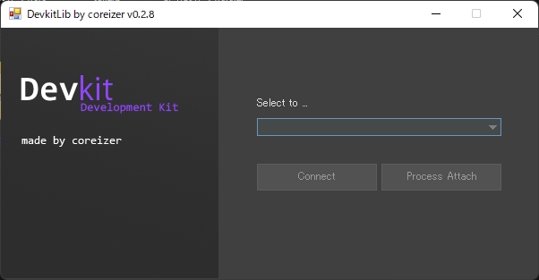

[](https://dl.circleci.com/status-badge/redirect/gh/coreizer/ChatHub/tree/master)

<div align="center">
  <a href="https://github.com/coreizer/ChatHub">
    
  </a>

  <h3 align="center">DevkitLibrary</h3>

純正の開発キットを使用して、簡単に接続する機能を提供します。

  <p align="center">
    <a href="">Bug Reports</a>
    ・
    <a href="">Request Feature</a>
  </p>
</div>

<details>
  <summary>一覧</summary>
  <ol>
    <li><a href="#📦-usage">Usage</a></li>
    <li><a href="#🖼️-screenshot">Screenshot</a></li>
    <li><a href="#💻-author">Author</a></li>
    <li><a href="#📝-license">License</a></li>
  </ol>
</details>

## 📦 Usage

Connection example:

```
// Xbox 360
DevKitClient client = new DevKitClient();
client.SetTarget(DevkitType.Xbox360, 0);

// PS3
DevKitClient client = new  DevKitClient();
client.SetTarget(DevkitType.PS3, 0);

// Connect to target
ConnectionStatus status = await client.ConnectTargetAsync();
if (status == ConnectionStatus.Connected) {
  MessageBox.Show("Connected !");
}
```

## 🖼️ Screenshot



## 🌏 Stay In Touch

- [Website coreizer.dev](https://www.coreizer.dev)
- [Twitter](https://www.twitter.com/coreizer)

## 💻 Author

coreizer

## 📝 License

This project is licensed under [GPL 3.0](https://opensource.org/license/lgpl-3-0/). See [License File](LICENSE) for details.
