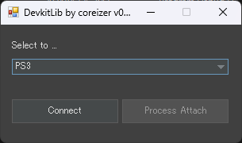

# DevkitLibrary
純正の開発キットを使用して、簡単に接続する機能を提供します。

## Usage
Connection example:
```
// Xbox 360
DevKitClient client = new DevKitClient();
client.SetTarget(DevkitType.Xbox360, 0);

// PS3
DevKitClient client = new  DevKitClient();
client.SetTarget(DevkitType.PS3, 0);

// Connect to target
ConnectionStatus status = await client.ConnectTargetAsync();
if (status == ConnectionStatus.Connected) {
  MessageBox.Show("Connected !");
}
```

## Screenshot


## Stay In Touch
 - [Website coreizer.dev](https://www.coreizer.dev)
 - [Twitter](https://www.twitter.com/coreizer)

## Author
coreizer

## License
[GPL v3.0 licensed.](LICENSE)
